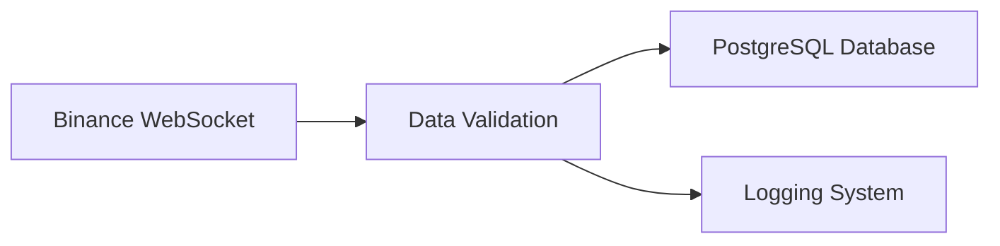

# Binance Data Streaming


A real-time cryptocurrency data streaming application that connects to [Binance WebSocket API](https://developers.binance.com/docs/binance-spot-api-docs/web-socket-streams) to collect OHLCV (Open, High, Low, Close, Volume) candlestick data and stores it in a PostgreSQL database.

## 📋 Table of Contents

- [Project Structure](#-project-structure)
- [Prerequisites](#-prerequisites)
- [Setup Instructions](#-setup-instructions)
  - [Poetry Setup](#1-poetry-setup)
  - [Activate Poetry Shell](#2-activate-poetry-shell)
  - [Environment Configuration](#3-environment-configuration)
  - [PostgreSQL Database Setup](#4-postgresql-database-setup)
- [Configuration](#-configuration)
- [Usage](#-usage)
- [Features](#-features)
- [Architecture](#-architecture)
- [Development](#-development)
- [Troubleshooting](#-troubleshooting)
- [Dependencies](#-dependencies)
- [Contributing](#-contributing)

## 📁 Project Structure
```
BINANCE_DATA_STREAMING/
├── app/
│   ├── __init__.py            # Python package marker
│   ├── __pycache__/
│   ├── binance_client.py      # WebSocket streaming client
│   ├── config.py              # Configuration management
│   ├── data_validation.py     # Pydantic data validation schemas
│   ├── database.py            # PostgreSQL database operations
│   └── logger_print.py        # Logging configuration
├── config/
│   ├── __init__.py            # Python package marker
│   └── config.toml            # Application configuration
├── test/                      # Test files
├── notebook.ipynb            # Jupyter notebook for analysis
├── .env.example              # Environment variables template
├── .gitignore               # Git ignore file
├── main.py                  # Application entry point
├── poetry.lock              # Poetry lock file
├── pyproject.toml          # Poetry project file
└── README.md               # This file
```
## 🔧 Prerequisites

- [Python 3.11+](https://www.python.org/downloads/)
- [PostgreSQL](https://www.postgresql.org/download/)
- [Poetry](https://python-poetry.org/docs/#installation) (Python dependency management)

## 🚀 Setup Instructions

### 1. Poetry Setup

Initialize [Poetry](https://python-poetry.org/) in your project directory:

```bash
poetry init
```

Add required packages:

```bash
poetry add asyncpg websockets pydantic python-dotenv
```

### 2. Activate Poetry Shell

First, install the [shell plugin](https://github.com/python-poetry/poetry-plugin-shell) for easier environment management:

```bash
poetry self add poetry-plugin-shell
```

Then activate the virtual environment:

```bash
poetry shell
```

Alternatively, you can use:

```bash
poetry env activate
```

### 3. Environment Configuration

Create a `.env` file based on the provided `.env.example`:

```bash
cp .env.example .env
```

Fill in the required variables in your `.env` file. You can find all the variables you need to configure in [`.env.example`](.env.example):

```env
# Binance API Configuration
BINANCE_API_KEY=your_binance_api_key_here

# Database Configuration
DATABASE_HOST=localhost
DATABASE_PORT=5432
DATABASE_NAME=binance_data
DATABASE_USER=your_username
DATABASE_PASSWORD=your_password
```

> 💡 **Tip**: Get your Binance API key from the [Binance API Management](https://www.binance.com/en/my/settings/api-management) page.

### 4. PostgreSQL Database Setup

#### 4.1 Create Database

Connect to your [PostgreSQL](https://www.postgresql.org/) instance and create a new database:

```sql
CREATE DATABASE binance_data;
```

#### 4.2 Create Table

Connect to your newly created database and create the required table:

```sql
\c binance_data;

CREATE TABLE ohlcv (
    id UUID PRIMARY KEY,
    timestamp BIGINT NOT NULL,
    open DECIMAL(20, 8) NOT NULL,
    high DECIMAL(20, 8) NOT NULL,
    low DECIMAL(20, 8) NOT NULL,
    close DECIMAL(20, 8) NOT NULL,
    volume DECIMAL(20, 8) NOT NULL,
    created_at TIMESTAMP DEFAULT CURRENT_TIMESTAMP
);

-- Optional: Add index for better query performance
CREATE INDEX idx_ohlcv_timestamp ON ohlcv(timestamp);
```

#### 4.3 Update Connection Info

Make sure your [`.env`](.env) file contains the correct PostgreSQL connection information:

```env
DATABASE_HOST=localhost        # Your PostgreSQL host
DATABASE_PORT=5432            # Your PostgreSQL port
DATABASE_NAME=binance_data    # Database name created above
DATABASE_USER=your_username   # Your PostgreSQL username
DATABASE_PASSWORD=your_password # Your PostgreSQL password
```

## ⚙️ Configuration

### Application Configuration

Modify [`config/config.toml`](config/config.toml) to adjust the streaming parameters:

```toml
[binance]   
symbol   = "BTCUSDC"    # Trading pair to monitor
interval = "1m"         # Candlestick interval (1m, 5m, 15m, 1h, etc.)
limit    = 1            # Number of candles (for historical data)
stream_url = "wss://stream.binance.com:9443/ws/{symbol}@kline_{interval}"
```

**Available intervals** (according to [Binance API docs](https://developers.binance.com/docs/binance-spot-api-docs/web-socket-streams#klinecandlestick-streams)):
- `1m`, `3m`, `5m`, `15m`, `30m`
- `1h`, `2h`, `4h`, `6h`, `8h`, `12h`
- `1d`, `3d`, `1w`, `1M`

**Popular trading pairs**:
- `BTCUSDT`, `ETHUSDT`, `BNBUSDT`
- `ADAUSDT`, `DOTUSDT`, `LINKUSDT`

## 🎯 Usage

### Running the Application

Start the data streaming:

```bash
python main.py
```

The application will:
1. Connect to [Binance WebSocket API](https://developers.binance.com/docs/binance-spot-api-docs/web-socket-streams)
2. Stream real-time candlestick data
3. Validate data using [Pydantic](https://docs.pydantic.dev/) schemas
4. Store validated data in PostgreSQL database
5. Log all operations

### Monitoring

The application includes comprehensive logging. You'll see output similar to:

```
[2025-06-29 10:30:15] INFO - Saved candle: DataValidation(t=1719661815000, o=65000.50, h=65100.25, l=64950.75, c=65075.00, v=150.25)
```

## ✨ Features

- **Real-time Data Streaming**: Connects to [Binance WebSocket](https://developers.binance.com/docs/binance-spot-api-docs/web-socket-streams) for live market data
- **Data Validation**: Uses [Pydantic](https://docs.pydantic.dev/) for robust data validation and type checking
- **Async Database Operations**: Efficient PostgreSQL operations using [asyncpg](https://magicstack.github.io/asyncpg/)
- **Error Handling**: Comprehensive error handling and logging
- **Configurable**: Easy configuration through [TOML](https://toml.io/) and environment variables
- **Type Safety**: Full type hints for better code maintainability

## 🏗️ Architecture

### Components

1. **[`binance_client.py`](app/binance_client.py)**: Handles WebSocket connection and data streaming
2. **[`data_validation.py`](app/data_validation.py)**: [Pydantic](https://docs.pydantic.dev/) models for data validation
3. **[`database.py`](app/database.py)**: Database connection and insertion operations
4. **[`config.py`](app/config.py)**: Configuration management from environment and TOML files
5. **[`logger_print.py`](app/logger_print.py)**: Centralized logging configuration

### Data Flow



```
Binance WebSocket → Data Validation → PostgreSQL Database
                       ↓
                   Logging System
```

## 🛠️ Development

### Adding New Features

1. **New Data Sources**: Extend [`binance_client.py`](app/binance_client.py) to support additional [Binance endpoints](https://developers.binance.com/docs/binance-spot-api-docs/web-socket-streams)
2. **Data Processing**: Add processing logic in the streaming loop
3. **Database Schema**: Modify table structure as needed for new data types
4. **Validation**: Update [Pydantic](https://docs.pydantic.dev/) models in [`data_validation.py`](app/data_validation.py)

### Testing

Run tests using:

```bash
poetry run pytest test/
```

### Code Quality

```bash
# Format code
poetry run black .

# Lint code
poetry run flake8 .

# Type checking
poetry run mypy .
```

## 🐛 Troubleshooting

### Common Issues

| Issue | Solution |
|-------|----------|
| **Database Connection Error** | Verify [PostgreSQL](https://www.postgresql.org/) is running and credentials in [`.env`](.env) are correct |
| **WebSocket Connection Error** | Check internet connection and [Binance API status](https://www.binance.com/en/support/announcement) |
| **Data Validation Error** | Ensure incoming data matches expected schema in [`data_validation.py`](app/data_validation.py) |
| **Poetry Installation Issues** | Follow the [official Poetry installation guide](https://python-poetry.org/docs/#installation) |

### Logs

Check application logs for detailed error information. All operations are logged with timestamps and severity levels.

### Useful Resources

- [Binance API Documentation](https://developers.binance.com/docs/)
- [PostgreSQL Documentation](https://www.postgresql.org/docs/)
- [Pydantic Documentation](https://docs.pydantic.dev/)
- [Poetry Documentation](https://python-poetry.org/docs/)

## 📦 Dependencies

- **[asyncpg](https://magicstack.github.io/asyncpg/)**: Async PostgreSQL driver
- **[websockets](https://websockets.readthedocs.io/)**: WebSocket client library  
- **[pydantic](https://docs.pydantic.dev/)**: Data validation and parsing
- **[python-dotenv](https://github.com/theskumar/python-dotenv)**: Environment variable management

## 📝 License

This project is licensed under the MIT License - see the [LICENSE](LICENSE) file for details.

## 🤝 Contributing

1. Fork the repository
2. Create your feature branch (`git checkout -b feature/AmazingFeature`)
3. Commit your changes (`git commit -m 'Add some AmazingFeature'`)
4. Push to the branch (`git push origin feature/AmazingFeature`)
5. Open a Pull Request
